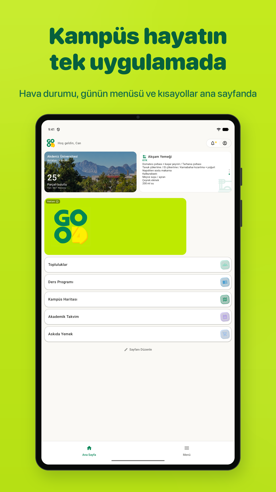
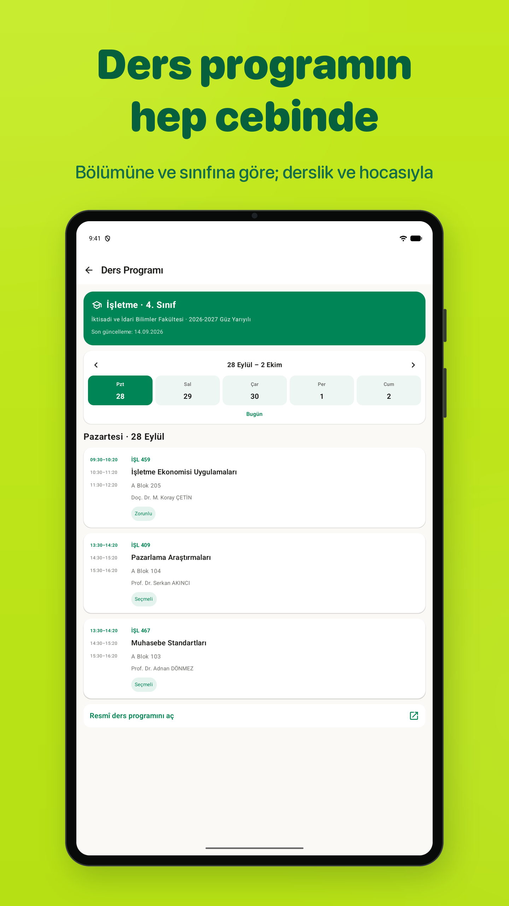
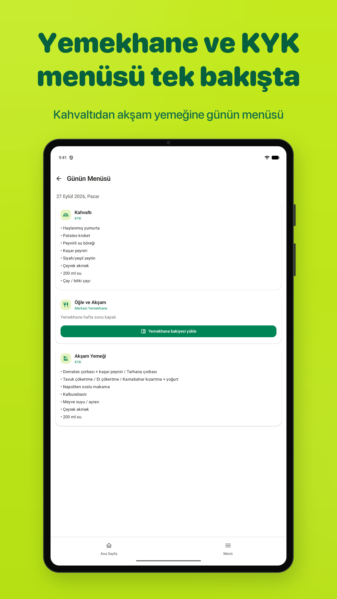
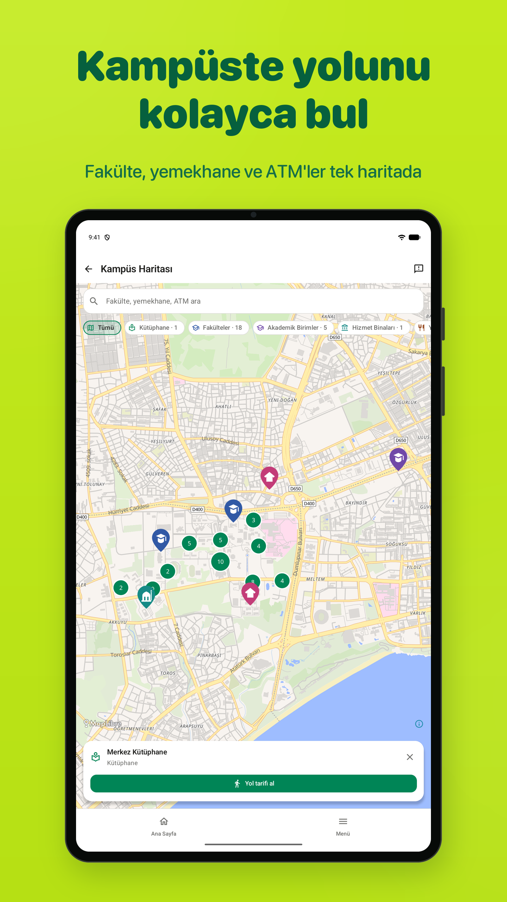
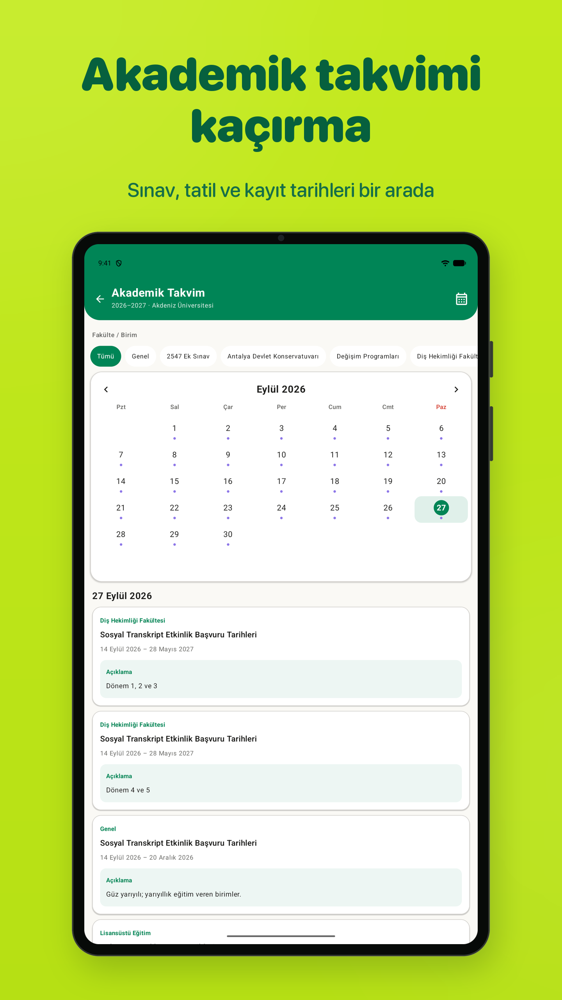
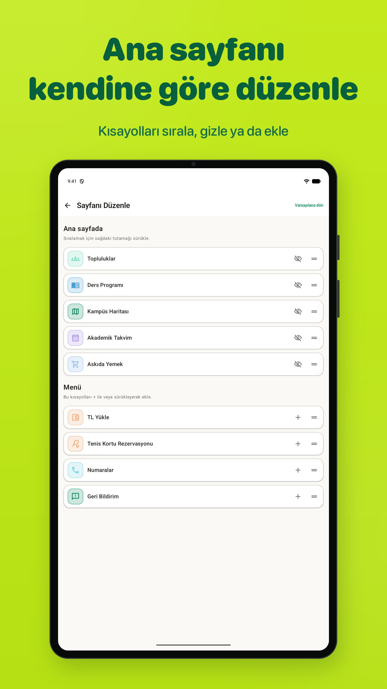

# Good4 V2 — 10 inç Android tablet mağaza görselleri

27 Eylül 2026 tarihinde Good4 V2 Android uygulamasından, penceresiz Android emülatöründe tablet ekran düzeniyle alınmıştır. Telefon ekranlarının büyütülmüş kopyaları değildir.

- Boyut: **1440 × 2560 px (9:16)**.
- Tablet düzeni: **800 dp ekran genişliği**, Android yoğunluğu 288 dpi.
- Biçim: **24 bit RGB PNG**, şeffaflık ve ek metadata içermez.
- Ana klasördeki altı görsel: limon yeşili arka plan, Türkçe başlıklar ve tablet çerçevesi.
- `ham-ekranlar/`: aynı altı ekranın başlıksız ve çerçevesiz özgün görüntüleri.
- Uygulama arayüzü yeniden çizilmemiştir; tasarımlı görsellerde yalnızca orantılı olarak küçültülmüştür.
- Başlıklar, alt yazılar, boyutlar, şeffaflık ve uygulama görüntüsünün korunması doğrulanmıştır.

## Yayın öncesi not

Görüntülerde **Askıda Yemek** kısayolu açık olan kurulu V2 derlemesi kullanılmıştır. `e952397` commit'i bu özelliği yeni yayın derlemelerinde geçici olarak gizler. Bu nedenle `01-home.png` ve `06-edit.png`, bu özellik kapalı olan sürüme yüklenmeden önce o sürümden yeniden alınmalıdır. Buradaki dosyalar onaylanan setin arşividir.

Google Play'in tablet alanları için uygulama dışı metin içermeyen **`ham-ekranlar/`** dosyaları kullanılmalıdır. [Resmî görsel kılavuzu](https://support.google.com/googleplay/android-developer/answer/9866151?hl=en).

## Setin önizlemesi

Tam boyutlu dosyayı açmak için görsele tıklayın.

| Ana sayfa | Ders programı | Günün menüsü |
| --- | --- | --- |
|  |  |  |

| Kampüs haritası | Akademik takvim | Sayfanı Düzenle |
| --- | --- | --- |
|  |  |  |

## Ham tablet ekranları

- [Ana sayfa](ham-ekranlar/01-home.png)
- [Ders programı](ham-ekranlar/02-schedule.png)
- [Günün menüsü](ham-ekranlar/03-menu.png)
- [Kampüs haritası](ham-ekranlar/04-map.png)
- [Akademik takvim](ham-ekranlar/05-calendar.png)
- [Sayfanı Düzenle](ham-ekranlar/06-edit.png)
