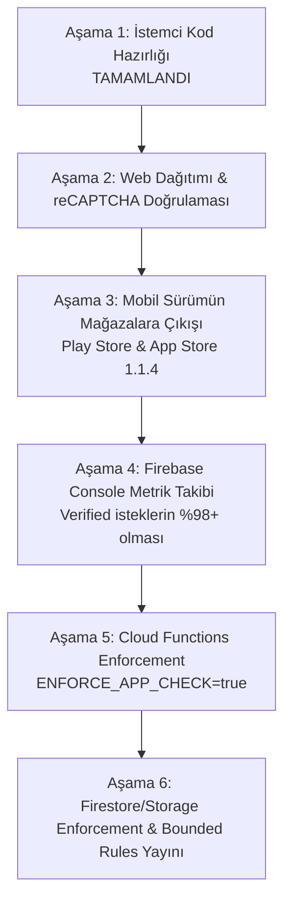

# Good4 App Check & Bounded Security Canlı Geçiş Yol Haritası

Bu belge, Good4 projesinin **Firebase App Check** ve **Firestore Bounded Rules (Sınırlı Sorgu)** güvenlik mekanizmalarını canlı üretim (`good4tr-v2`) ortamında sıfır kesintiyle devreye almak için izlenecek adım adım stratejik yol haritasıdır.

---

## 🎯 Nihai Hedef
1. **App Check Zorunluluğu (Enforcement)** ile yetkisiz istemcileri, botları, API scraping araçlarını ve tersine mühendislikle üretilmiş sahte istekleri Firebase seviyesinde engellemek.
2. **Bounded Firestore Rules** ile sınırsız koleksiyon sorgularını (`limit <= 100`) veritabanı seviyesinde engelleyerek Denial-of-Wallet (maliyet patlatma) risklerini sıfıra indirmek.

---

## 🗺️ Aşama Aşama Uygulama Planı



---

### ✅ Aşama 1: İstemci ve Kod Tabanı Hazırlığı (Tamamlandı)
- [x] Android ve iOS Firestore repository sınıflarındaki tüm liste ve filtreleme sorgularına `limit(100)` eklendi (`FirestoreRepositoryAndroidImpl.kt`, `FirestoreRepositoryIOSImpl.kt`).
- [x] Etkinlik katılım ve takipçi dinleyicilerine (`EventAdmission`) `limit(100)` eklendi.
- [x] Web yönetim panelindeki `loadCampaigns` sorgusu `limit(100)` ile sınırlandırıldı (`App.tsx`).
- [x] Web paneli için `firebase.json`'a katı Content-Security-Policy (CSP) başlığı eklendi.
- [x] Web ve Android testleri/derlemeleri başarıyla tamamlandı.

---

### ⏳ Aşama 2: Web Paneli Dağıtımı ve Canlı Doğrulama
Web panelindeki reCAPTCHA Enterprise entegrasyonu canlı alan adında test edilmeli ve kanıtlanmalıdır.

1. **Dağıtım (Deploy):**
   - [`firebase/v2/WEB_SECURITY_DEPLOYMENT_HANDOFF.md`](./WEB_SECURITY_DEPLOYMENT_HANDOFF.md) belgesindeki adımlar takip edilerek **yalnızca Hosting** servisi deploy edilir:
     ```bash
     cd firebase/v2
     npm --prefix web test
     npm --prefix web run build
     npx firebase deploy --only hosting --project good4tr-v2
     ```
2. **Doğrulama (Verification):**
   - Gizli pencerede açılan panelde Callable isteklere `X-Firebase-AppCheck` header'ının eklendiği kontrol edilir.
   - Google Cloud Logs Explorer'da şu filtrenin `jsonPayload.verifications.app = "VALID"` döndüğü doğrulanır:
     ```text
     resource.type="cloud_run_revision"
     labels."firebase-log-type"="callable-request-verification"
     jsonPayload.verifications.app="VALID"
     ```

---

### ⏳ Aşama 3: Mobil Sürümün Mağazalara Sunulması
- Good4 Android (Play Integrity) ve iOS (App Attest) 1.1.4 sürümleri Google Play Console ve Apple App Store Connect'e yüklenir.
- Google Play Console -> Integrity API bağlantısının Firebase projesiyle eşleştiği teyit edilir.
- Firebase Console -> App Check -> Apps altında Android ve iOS uygulamalarının kayıtlı (Registered) olduğu teyit edilir.

---

### ⏳ Aşama 4: Firebase Console Metrik Takibi (İzleme Modu)
> [!IMPORTANT]
> Eski uygulama sürümlerini kullanan öğrencilerin kesinti yaşamaması için bu aşamada **Enforce butonuna basılmaz**. Yalnızca metrikler izlenir.

1. Firebase Console -> **App Check** -> **Metrics** sekmesi açılır.
2. Cloud Functions, Cloud Firestore ve Storage için gelen istek dağılımı incelenir:
   - **Verified Requests:** Yeni sürümden gelen meşru istekler.
   - **Unverified Requests:** Eski sürümlerden veya token'sız gelen istekler.
3. *Unverified* oranı **%1-2 seviyesine düşene kadar** beklenir. Gerekirse uygulama içi `update_notice` ile kullanıcılara zorunlu güncelleme bildirimi verilir.

---

### ⏳ Aşama 5: Cloud Functions Seviyesinde App Check Zorunluluğu
Metrikler güvenli seviyeye ulaştığında ilk kilit Cloud Functions üzerinde açılır:

1. `firebase/v2/functions/.env.good4tr-v2` (veya Cloud Functions environment variables) dosyasına şu bayrak eklenir:
   ```env
   ENFORCE_APP_CHECK=true
   ```
2. Cloud Functions prodüksiyona yayınlanır:
   ```bash
   npx firebase deploy --only functions --project good4tr-v2
   ```
3. Mobil ve web üzerinden kritik fonksiyonlar (ör. `getPortalContext`, `getMarketFeed`) test edilir; yetkisiz dış çağrıların 401 aldığı doğrulanır.

---

### ⏳ Aşama 6: Firestore / Storage Enforcement ve Bounded Rules Yayını
Son aşamada veritabanı kilitleri kapatılır:

1. **Firestore ve Storage App Check Enforcement:**
   - Firebase Console -> App Check sekmesine gidilir.
   - **Cloud Firestore** seçilir ve **"Enforce"** butonuna tıklanır.
   - **Firebase Storage** seçilir ve **"Enforce"** butonuna tıklanır.
2. **Bounded Kurallarının Yayını:**
   - `firebase/v2/firebase.json` dosyasında firestore kuralı güncellenir:
     ```json
     "firestore": {
       "rules": "firestore.bounded.rules",
       "indexes": "firestore.indexes.json"
     }
     ```
   - Kurallar canlıya deploy edilir:
     ```bash
     npx firebase deploy --only firestore:rules --project good4tr-v2
     ```
3. Artık sistem hem App Check token'ı olmayan istekleri reddeder hem de limitsiz sorguları engelleyerek maliyetleri koruma altına alır.

---

## 🚨 Geri Alma (Rollback) Planı

Canlıda beklenmedik bir kesinti yaşanması durumunda:
1. **Firestore/Storage için:** Firebase Console -> App Check -> İlgili servis -> **"Un-enforce" (İzleme Moduna Dön)** butonuna basılır (Etkisi 1-2 dakika içinde devreye girer).
2. **Cloud Functions için:** `ENFORCE_APP_CHECK=false` yapılarak functions redeploy edilir.
3. **Firestore Kuralları için:** `firebase.json` tekrar `firestore.rules` yapılarak `npx firebase deploy --only firestore:rules` çalıştırılır.
